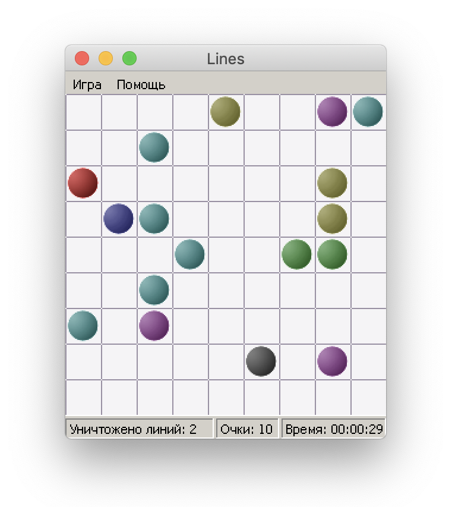

# Lines

> **Disclaimer**
> 
> This application was developed back in 2008 by Igor Khorlo as a high school project and uploaded to GitHub for archive purposes.

This GUI application is a reimplementation of the [Lines](https://ru.wikipedia.org/wiki/Color_Lines) game that was quite popular in the 90s. It was written in [Object Pascal](https://en.wikipedia.org/wiki/Object_Pascal) with the great help of [Delphi 7](https://en.wikipedia.org/wiki/Delphi_(IDE)) IDE for the [Windows NT](https://en.wikipedia.org/wiki/Windows_NT) operating system.

## How to run it today?

The game was developed under Windows XP back in 2008 (11 years ago for today, 15th May 2019), so if you are running Windows, you probably would be able to run natively the `Project1.exe` binary (maybe with some additional compatibility settings). On macOS and Linux, you would need [Wine](https://www.winehq.org/):

```sh
LC_ALL=ru_RU.UTF-8 wine Project1.exe
```

It was tested on macOS Mojave (10.14.4) in May 2019 and had no issues.

## Screenshots


